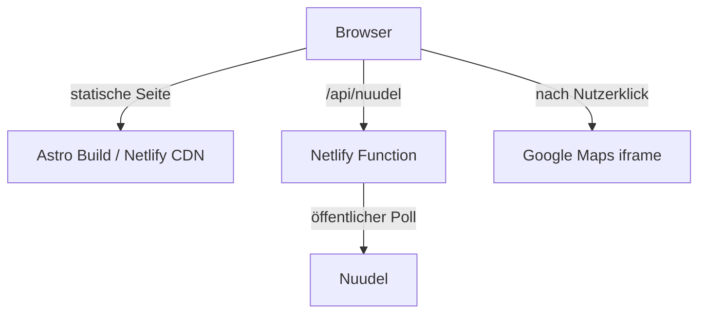

# Dienstagstraining

Moderne responsive Website für eine private Basketballgruppe in Frankfurt am Main.

**Live-Demo:** [mellow-sorbet-f36408.netlify.app](https://mellow-sorbet-f36408.netlify.app)

Die Website verbindet einen statischen Astro-Auftritt mit aktuellen Trainingsdaten aus einer öffentlichen Nuudel-Umfrage. Das Design ist bewusst reduziert, typografisch und auf Desktop, Tablet und Mobile ausgelegt.

<!-- TODO: Saubere Desktop- und Mobile-Screenshots ergänzen. -->

## Features

- Responsive Astro-Website für Desktop, Tablet und Mobile
- Cineastischer Hero mit eigenem Basketball-/Korbanimationsvideo und Frame-0-Poster
- Sticky Navigation mit Scrollspy für die Startseitenabschnitte
- Section-Reveals, `prefers-reduced-motion`-Unterstützung und Safari-Scroll-Restoration-Fix
- Live-Trainingsstatus über eine Netlify Function und die Same-Origin-API `/api/nuudel`
- Ermittlung des nächsten Trainingstermins mit Europe/Berlin-Zeitlogik
- Aktuelle Ja-/Vielleicht-Zählung ohne Teilnehmerlisten im Frontend
- Zeitlich eingegrenzter Kommentar-Zyklus und sichtbarer Fehlerzustand bei nicht verfügbaren Daten
- Anfahrt zur Trainingsort mit Google Maps: Die interaktive Karte wird erst nach Nutzeraktion geladen
- Bereiche für Über uns, „Basketball von A bis Bier“, Kastenmann, Mitspielen, Links sowie rechtliche Seiten

## Tech Stack

- Astro
- HTML, CSS, JavaScript und TypeScript
- Netlify und Netlify Functions
- Node.js- und Web-APIs
- Nuudel als öffentliche Datenquelle
- Google Maps iframe nach Nutzerinteraktion
- Blender für das Hero-Rendering

## Architektur



Die Hauptseite wird statisch ausgeliefert. Dynamische Trainingsdaten werden serverseitig gelesen; es gibt keinen direkten Browser-Fetch zu Nuudel. Google Maps wird nicht beim initialen Seitenaufruf geladen.

## Robustheit und Fallbacks

- Nuudel-Daten werden frisch serverseitig gelesen; API-Responses werden nicht langfristig gecacht.
- Die sichtbare Seite aktualisiert Trainingsdaten regelmäßig, während versteckte Tabs keine unnötigen Polling-Requests erzeugen.
- Parser- oder Abruffehler zeigen keinen alten, scheinbar aktuellen Trainingsstatus.
- Kommentare werden nur mit belastbarem Zeitstempel innerhalb ihres relevanten Zyklus angezeigt.
- Bei Reduced Motion bleibt der Hero statisch; das Poster verhindert sichtbare Video-Ladesprünge.

## Datenschutzorientierte Entscheidungen

- Kein Analytics, Marketing-Tracking oder Tracking-Skripte.
- Google Maps wird erst nach einer aktiven Nutzerentscheidung geladen.
- Nuudel wird serverseitig abgefragt; das Frontend erhält nur aggregierte Trainingszahlen, keine Teilnehmerliste.
- Impressum, Datenschutz und Disclaimer sind als eigene Seiten vorhanden.

## Local Development

Voraussetzungen: Node.js und npm.

```sh
npm install
cp .env.example .env
npm run dev
```

Für lokal korrekte rechtliche Seiten müssen die Werte in `.env` angepasst werden. Ein Produktionsbuild läuft mit:

```sh
npm run build
```

## Netlify und Deployment

- Build: `npm run build`
- Publish directory: `dist`
- Functions: `netlify/functions`
- Konfiguration: `netlify.toml`

Aktueller manueller Draft-Deploy:

```sh
npx netlify-cli@latest deploy
```

Production-Deploy:

```sh
npx netlify-cli@latest deploy --prod
```

Da eine Netlify Function verwendet wird, ist ein reines `dist`-Drag-and-Drop nicht der vollständige Deploymentweg. Bei einer späteren Netlify-Git-Verknüpfung müssen die `LEGAL_*`-Werte als Build-Environment gesetzt werden.

## Projektstruktur

```text
src/
  components/
  config/
  layouts/
  pages/
  styles/
netlify/
  functions/
public/
  images/
  videos/
docs/
netlify.toml
```

## Technische Highlights

- CORS-Grenze von Nuudel über eine serverseitige Netlify Function und eine Same-Origin-API gelöst.
- Die öffentliche Nuudel-Poll-HTML ist die serverseitige Source of Truth für Termine, Statuswerte, Beschreibung und Kommentare. Der frühere CSV-Export wurde verworfen, nachdem er bei kurzfristigen Statusänderungen veraltete Werte geliefert hatte.
- Nächster Trainingstermin wird dynamisch statt über eine fest codierte Wochenlogik ausgewählt.
- Europe/Berlin-Zeitgrenzen und Kommentar-Reset ohne Änderung externer Nuudel-Daten.
- Progressive Google-Maps-Einbindung und Hero-Poster als Frame-0-Fallback.

## Status

Aktiver persönlicher/Portfolio-Webauftritt.

Mögliche nächste Schritte: eigene Domain, finale Kontaktadresse für den Mitspielen-CTA, weitere Inhalte oder Links sowie zusätzliche Browser- und Accessibility-QA.

## Development Process

Das Projekt entstand iterativ mit AI-assisted Development als Werkzeug für Implementierung, Review und Debugging. Architekturentscheidungen, Anforderungen, Tests und Abnahmen wurden projektbezogen gesteuert.

## Lizenz

Source code is published for portfolio and reference purposes. No open-source license is currently granted.
