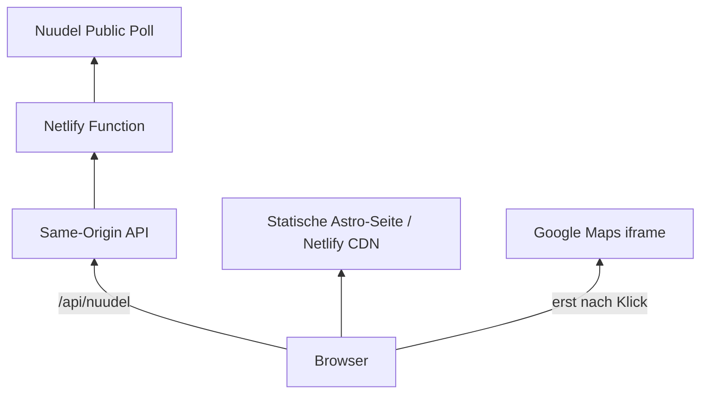

# Architektur

## 1. Systemübersicht

Die Website kombiniert einen statischen Astro-Build mit einer kleinen serverseitigen Datenintegration. Es wird keine Teilnehmerliste persistiert.

## 2. Static Frontend

Astro rendert Seiten, Layout, Navigation und Styles statisch. Der Browser lädt Trainingsdaten ausschließlich über `/api/nuudel` nach.

## 3. Hero / Media

Der Hero verwendet ein selbst gerendertes V17-Basketballvideo. Ein Poster aus Frame 0 verhindert einen sichtbaren Wechsel während des Video-Ladens. Bei `prefers-reduced-motion` bleibt der Hero statisch.

## 4. Navigation / Scrollspy

Der Header kommt aus dem gemeinsamen Layout und ist sticky. Auf der Startseite setzt ein `IntersectionObserver` den aktiven Navigationspunkt in einer zentralen Viewport-Zone. Abschnittsanker nutzen `scroll-margin-top`.

## 5. Training / Nuudel

Die Startseite lädt Trainingsdaten über `/api/nuudel`. Die öffentliche Nuudel-URL wird nicht direkt aus dem Browser gelesen, weil die Poll-Seite keine geeignete CORS-Freigabe bietet.

## 6. Netlify Function

`netlify/functions/nuudel.mjs` liest die öffentliche Nuudel-Poll-HTML mit `cache: 'no-store'`. Sie ist die Source of Truth für Termine, Statuswerte, Beschreibung und Kommentare. Die Redirect-Regel in `netlify.toml` stellt die Function als `/api/nuudel` bereit.

## 7. Termin-Auswahl

Der Parser verarbeitet mehrere Datums- und Zeitspalten und wählt den nächsten noch nicht vergangenen Termin. Die Entscheidung nutzt `Europe/Berlin`; sie ist nicht an eine feste Kalenderwoche oder Spaltenposition gekoppelt.

## 8. Statuszählung

Die Function zählt nur die relevanten Statuswerte für Ja und Vielleicht. Namen oder vollständige Teilnehmerdaten werden nicht an das Frontend weitergegeben.

## 9. Kommentar-Zyklus

Öffentliche Kommentare werden nur berücksichtigt, wenn ein belastbarer Zeitstempel vorhanden ist und sie nach dem vorherigen Termin liegen. Dadurch bleiben historische Kommentare nicht unbegrenzt sichtbar.

## 10. Error Handling

Antworten der Function sind nicht langfristig gecacht. Bei Abruf- oder Parserfehlern zeigt der Browser einen klaren nicht-verfügbar-Zustand statt veralteter Zahlen. Der 60-Sekunden-Refresh läuft nur bei sichtbarem Tab.

## 11. Anfahrt / Google Maps

Die Adresse und ein Google-Maps-Routenlink sind statisch. Das iframe wird erst durch den Button „Interaktive Karte laden“ erzeugt; beim initialen Laden wird kein Google-Maps-Request ausgelöst.

## 12. Datenschutzorientierte Entscheidungen

Es gibt kein Analytics und keine Marketing-Tracker. Nuudel-Zugriffe laufen über den Server, und nur aggregierte Trainingsdaten erreichen den Browser. Rechtliche Betreiberwerte werden beim Build aus `LEGAL_*`-Variablen gelesen.

## 13. Deployment

Netlify baut mit `npm run build`, veröffentlicht `dist` und stellt Functions aus `netlify/functions` bereit. Ein vollständiger Deploy erfolgt per Netlify CLI oder später über eine Git-Verknüpfung, nicht nur per `dist`-Upload.

## 14. Bekannte Grenzen

Die Nuudel-Integration hängt von der öffentlichen HTML-Struktur ab. Externe Dienste wie Nuudel, Netlify, Google Maps und deren Datenschutzbedingungen liegen außerhalb des Projekts.

## Wichtige technische Entscheidungen

### A) Astro / statischer Build

Astro hält die Website klein, schnell und mit wenig Runtime-Komplexität.

### B) Netlify Function für Nuudel

Die Function umgeht CORS, behält Parser- und Fehlerlogik auf derselben Origin und begrenzt die ausgelieferten Daten.

### C) Öffentliche Poll-HTML als Source of Truth

Der aktuelle Parser verwendet die öffentliche Poll-HTML für Termine, Statuswerte, Beschreibung und Kommentare. Der zuvor verwendete CSV-Export wurde als Source of Truth verworfen, nachdem er bei kurzfristigen Abstimmungsänderungen veraltete Werte geliefert hatte.

### D) Kein langfristiger Nuudel-Cache

Änderungen sollen nach einem Reload zeitnah sichtbar sein; deshalb nutzt der Abruf `no-store`.

### E) 60-Sekunden-Refresh nur bei sichtbarer Seite

Der Browser aktualisiert nur bei sichtbarem Tab und vermeidet damit unnötige Hintergrundlast.

### F) Kommentar-Zyklus

Historische Nuudel-Kommentare sollen nicht wochenlang als aktueller Hinweis erscheinen.

### G) Google Maps 2-Klick

Google wird nicht beim bloßen Seitenaufruf kontaktiert.

### H) Hero Poster aus Frame 0

Das Poster verhindert insbesondere auf Safari/iPhone einen visuellen Sprung vor der Video-Wiedergabe.
